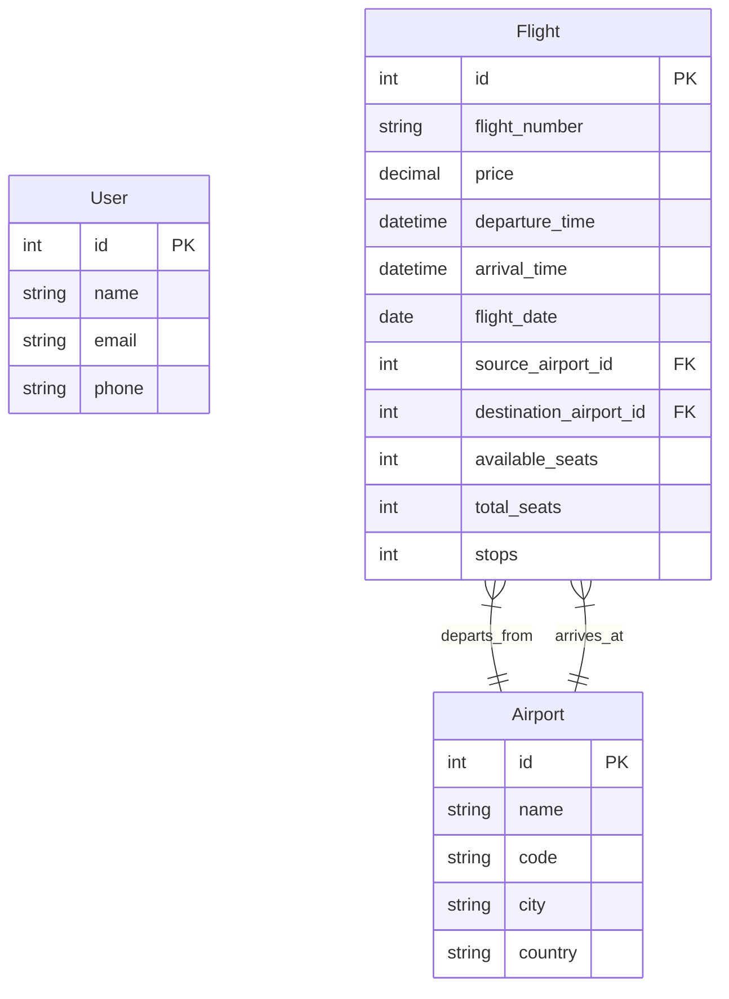
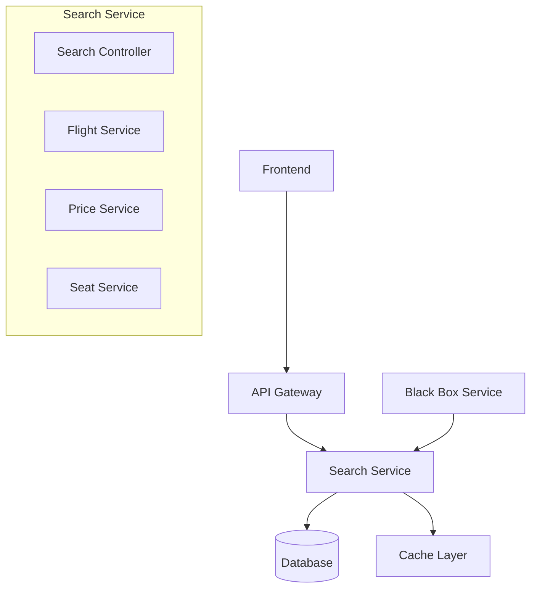
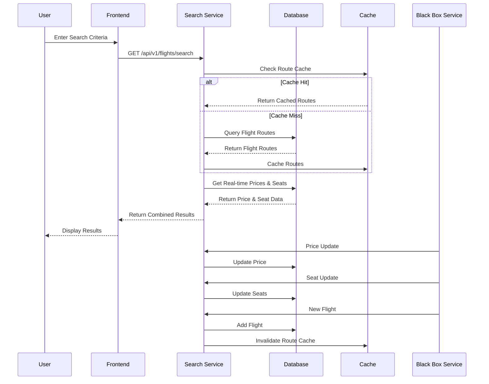
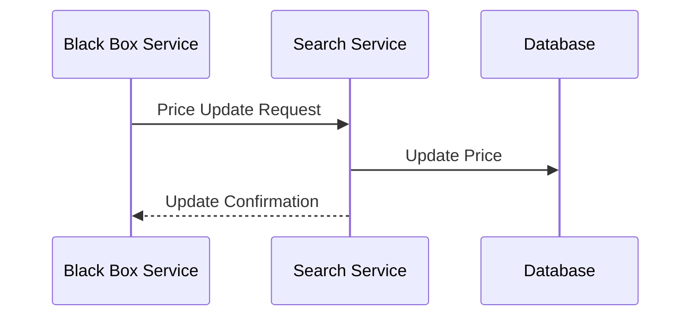

# Cleartrip Search Page Design Document

## Table of Contents
1. [System Overview](#system-overview)
2. [Database Design](#database-design)
3. [API Specifications](#api-specifications)
4. [System Architecture](#system-architecture)
5. [Flow Diagrams](#flow-diagrams)
6. [Technical Considerations](#technical-considerations)

## System Overview

The Cleartrip search page is designed to provide users with a seamless flight search experience. The system allows users to search for flights based on source, destination, and date, with additional features like passenger count, sorting, and filtering options.

### Key Features
- Flight search with source, destination, and date
- Passenger count selection
- Sorting options (price, arrival, departure)
- Filtering options (number of stops)
- Real-time price and seat availability updates

## Database Design

### Entity Relationship Diagram



### Database Tables Description

1. **User**
   - Stores user information
   - Used for authentication and personalization

2. **Airport**
   - Contains airport details
   - Used for source and destination mapping

3. **Flight**
   - Core table storing flight information
   - Links to airports for source and destination
   - Tracks seat availability and price
   - Includes number of stops

## API Specifications

### 1. Search Flights API
```
GET /api/v1/flights/search

Parameters:
- source_airport_id (required): ID of source airport
- destination_airport_id (required): ID of destination airport
- date (required): Flight date
- passengers (required): Number of passengers
- sort_by (optional): price/arrival/departure
- filters (optional):
  - stops: direct/one_stop/multiple_stops
  - price_range: min_price, max_price
  - airlines: array of airline_ids

Response:
{
    "flights": [
        {
            "id": string,
            "flight_number": string,
            "airline": string,
            "price": decimal,
            "departure_time": datetime,
            "arrival_time": datetime,
            "stops": integer,
            "available_seats": integer
        }
    ],
    "total_count": integer,
    "page": integer,
    "page_size": integer
}
```

### 2. Flight Details API
```
GET /api/v1/flights/{id}

Parameters:
- id (required): Flight ID

Response:
{
    "id": string,
    "flight_number": string,
    "airline": string,
    "price": decimal,
    "departure_time": datetime,
    "arrival_time": datetime,
    "source_airport": {
        "id": string,
        "name": string,
        "code": string
    },
    "destination_airport": {
        "id": string,
        "name": string,
        "code": string
    },
    "stops": integer,
    "available_seats": integer,
    "total_seats": integer
}
```

### 3. Price Update API (Internal)
```
POST /api/v1/flights/price-update

Body:
{
    "flight_id": string,
    "new_price": decimal,
    "timestamp": datetime
}

Response:
{
    "success": boolean,
    "message": string
}
```

### 4. Seat Update API (Internal)
```
POST /api/v1/flights/seat-update

Body:
{
    "flight_id": string,
    "available_seats": integer,
    "timestamp": datetime
}

Response:
{
    "success": boolean,
    "message": string
}
```

### 5. New Flight API (Internal)
```
POST /api/v1/flights/new

Body:
{
    "flight_number": string,
    "source_airport_id": integer,
    "destination_airport_id": integer,
    "departure_time": datetime,
    "arrival_time": datetime,
    "price": decimal,
    "total_seats": integer,
    "available_seats": integer
}

Response:
{
    "success": boolean,
    "message": string,
    "flight_id": string
}
```

## System Architecture



### Components Description

1. **Frontend**
   - React-based web application
   - Responsive design
   - Real-time updates

2. **API Gateway**
   - Request routing
   - Rate limiting
   - Authentication
   - Load balancing

3. **Search Service**
   - Core business logic
   - Flight search and filtering
   - Real-time price and seat management
   - Route caching for static flight data

4. **Database**
   - PostgreSQL for primary storage
   - Redis for route caching
   - Proper indexing for performance

5. **Black Box Service**
   - External service for price updates
   - Seat availability updates
   - New flight additions

## Flow Diagrams

### Search Flow



### Price Update Flow



## Technical Considerations

### Scalability
- Horizontal scaling of services
- Database sharding for large datasets
- Route caching strategy for static flight data

### Performance
- Database indexing on frequently queried fields
- Route caching for source-destination-date combinations
- Pagination for large result sets
- Efficient query optimization

### Cache Strategy
- Cache Key Format: `{source_airport_id}:{destination_airport_id}:{date}`
- Cache Duration: 24 hours
- Cache Invalidation:
  - New flight addition
  - Flight cancellation
  - Schedule changes
- Cache Content:
  - Flight numbers
  - Departure/arrival times
  - Number of stops
  - Route information
  - Excludes: prices and seat availability

### Reliability
- Direct price and seat updates
- Error handling and retry mechanisms
- Circuit breakers for external services

### Security
- API authentication and authorization
- Rate limiting
- Input validation
- Data encryption

### Monitoring
- Service health checks
- Performance metrics
- Error tracking
- Usage analytics

### Future Considerations
1. Multi-city search
2. Advanced filtering options
3. Personalized recommendations
4. Integration with other travel services
5. Mobile app support
