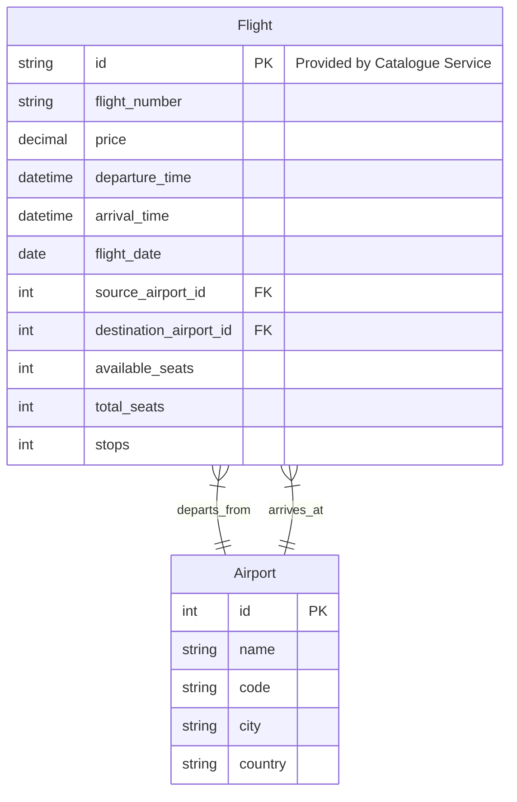
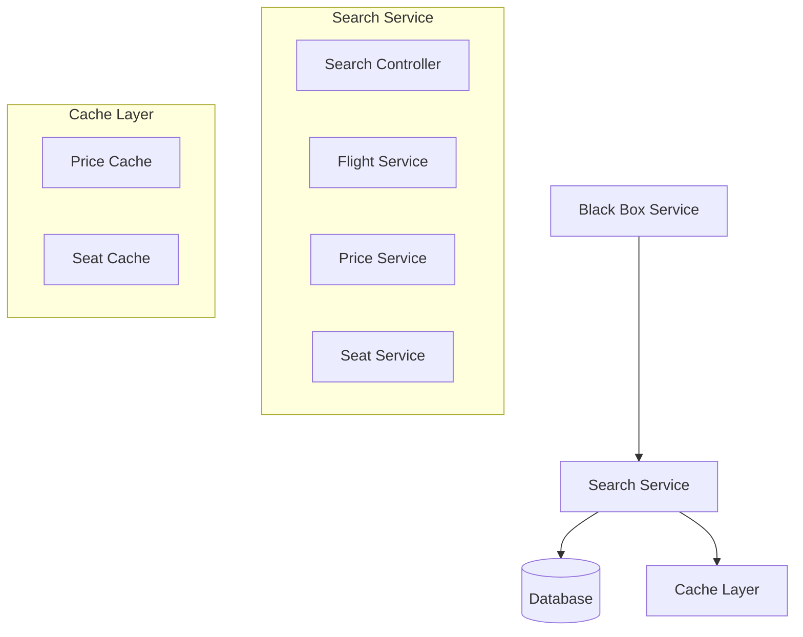
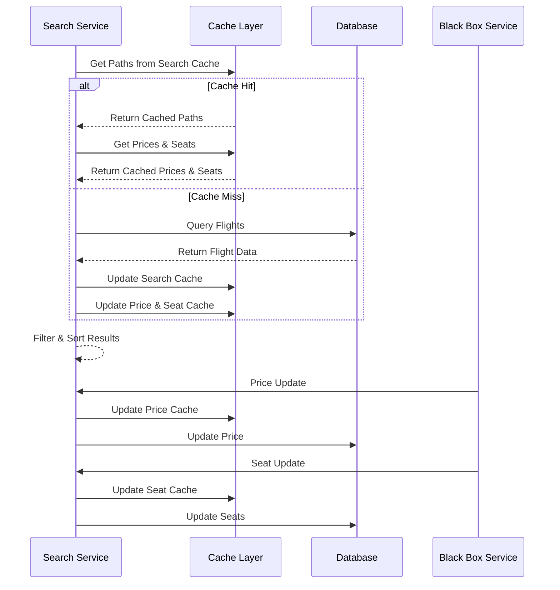
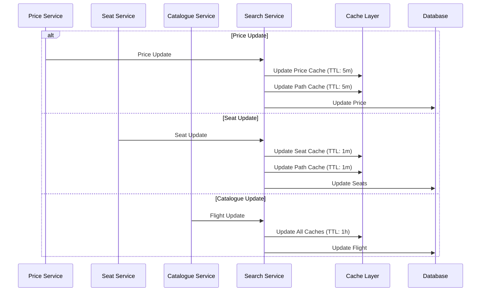
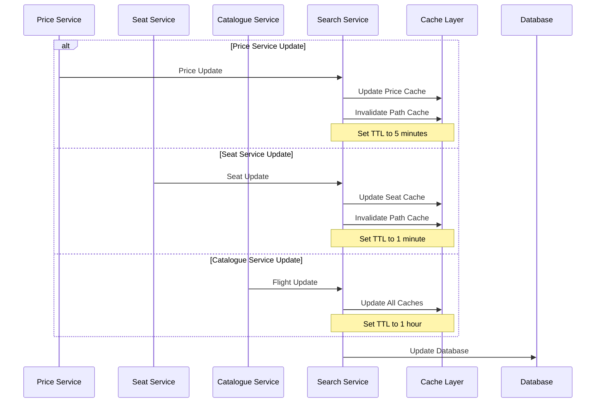

# Cleartrip Search Page Design Document

## Table of Contents
1. [System Overview](#system-overview)
2. [Database Design](#database-design)
3. [API Specifications](#api-specifications)
4. [System Architecture](#system-architecture)
5. [Flow Diagrams](#flow-diagrams)
6. [Technical Considerations](#technical-considerations)

## System Overview

The Cleartrip search service is designed to provide flight search functionality. The system allows searching for flights based on source, destination, and date, with additional features like passenger count, sorting, and filtering options.

### Key Features
- Flight search with source, destination, and date
- Passenger count selection
- Sorting options (price, arrival, departure)
- Filtering options (number of stops)
- Real-time price and seat availability updates

## Database Design

### Entity Relationship Diagram



### Database Tables Description

1. **Airport**
   - Contains airport details
   - Used for source and destination mapping

2. **Flight**
   - Core table storing flight information
   - Links to airports for source and destination
   - Tracks seat availability and price
   - Includes number of stops
   - Flight ID is provided by Catalogue Service

## API Specifications

### 1. Search Flights API
```
GET /api/v1/flights/search

Parameters:
- source_airport_id (required): ID of source airport
- destination_airport_id (required): ID of destination airport
- date (required): Flight date
- passengers (required): Number of passengers
- sort_by (optional): price/arrival/departure
- filters (optional):
  - stops: direct/one_stop/multiple_stops
  - price_range: min_price, max_price
  - airlines: array of airline_ids

Response:
{
    "flights": [
        {
            "id": string,
            "flight_number": string,
            "airline": string,
            "price": decimal,
            "departure_time": datetime,
            "arrival_time": datetime,
            "stops": integer,
            "available_seats": integer
        }
    ],
    "total_count": integer,
    "page": integer,
    "page_size": integer
}
```

### 2. Flight Details API
```
GET /api/v1/flights/{id}

Parameters:
- id (required): Flight ID

Response:
{
    "id": string,
    "flight_number": string,
    "airline": string,
    "price": decimal,
    "departure_time": datetime,
    "arrival_time": datetime,
    "source_airport": {
        "id": string,
        "name": string,
        "code": string
    },
    "destination_airport": {
        "id": string,
        "name": string,
        "code": string
    },
    "stops": integer,
    "available_seats": integer,
    "total_seats": integer
}
```

### 3. Price Update API (Internal)
```
POST /api/v1/flights/price-update

Body:
{
    "flight_id": string,
    "new_price": decimal,
    "timestamp": datetime
}

Response:
{
    "success": boolean,
    "message": string
}
```

### 4. Seat Update API (Internal)
```
POST /api/v1/flights/seat-update

Body:
{
    "flight_id": string,
    "available_seats": integer,
    "timestamp": datetime
}

Response:
{
    "success": boolean,
    "message": string
}
```

## System Architecture



### Components Description

1. **Search Service**
   - Core business logic
   - Flight search and filtering
   - Price and seat management
   - Receives flight data from Catalogue Service

2. **Database**
   - PostgreSQL for primary storage
   - Redis for caching
   - Proper indexing for performance

3. **Black Box Service**
   - External service for price updates
   - Seat availability updates

4. **Cache Layer**
   - Redis-based caching for price and seat updates
   - In-memory storage for frequently accessed data
   - TTL-based cache invalidation

## Cache Design

### 1. Path-based Search Cache
```
Key Format: search:path:{source_airport_id}:{destination_airport_id}:{date}
Value: {
    "paths": [
        [
            {
                "flight_id": string,
                "flight_number": string,
                "departure_time": datetime,
                "arrival_time": datetime,
                "source_airport_id": integer,
                "destination_airport_id": integer,
                "stops": integer
            }
        ]
    ],
    "last_updated": timestamp,
    "ttl": integer "in seconds"
}
Default TTL: 1 hour
TTL Rules:
- Price Service Update: 5 minutes
- Seat Service Update: 1 minute
- Catalogue Service Update: 1 hour
```

### 2. Price Cache
```
Key Format: flight:price:{flight_id}
Value: {
    "price": decimal,
    "last_updated": timestamp,
    "ttl": integer "in seconds"
}
Default TTL: 5 minutes
TTL Rules:
- Price Service Update: 5 minutes
- Seat Service Update: No change
- Catalogue Service Update: 1 hour
```

### 3. Seat Cache
```
Key Format: flight:seats:{flight_id}
Value: {
    "available_seats": integer,
    "last_updated": timestamp,
    "ttl": integer "in seconds"
}
Default TTL: 1 minute
TTL Rules:
- Price Service Update: No change
- Seat Service Update: 1 minute
- Catalogue Service Update: 1 hour
```

## Flow Diagrams

### Search Flow with Cache



### Cache Update Flow with Dynamic TTL



### Cache Invalidation Flow



## Technical Considerations

### Scalability
- Horizontal scaling of services
- Database sharding for large datasets
- Caching strategy for frequently accessed data
- Redis cluster for cache scaling
- Cache partitioning by region/airport
- Dynamic TTL management

### Performance
- Database indexing on frequently queried fields
- Caching of search results
- Pagination for large result sets
- Efficient query optimization
- Cache hit ratio monitoring
- Cache warming strategies
- Path-based cache optimization
- TTL-based cache optimization

### Reliability
- Direct price and seat updates
- Error handling and retry mechanisms
- Circuit breakers for external services
- Cache fallback mechanisms
- Cache consistency checks
- Cache replication for high availability
- TTL consistency across services

### Future Considerations
1. Multi-city search
2. Advanced filtering options
3. Personalized recommendations
4. Integration with other travel services
5. Dynamic schedule adjustments
6. Holiday calendar integration
7. Cache pre-warming strategies
8. Regional cache distribution
9. Advanced path optimization
10. Real-time price prediction

## Catalogue Service APIs

The Catalogue Service is a separate service responsible for managing flight schedules and generating individual flights. It is the source of truth for flight IDs and schedules.

### 1. Create Flight Entry API
```
POST /api/v1/catalogue/flight-entry

Body:
{
    "source_airport_id": integer,
    "destination_airport_id": integer,
    "departure_time": time,
    "start_date": date,
    "end_date": date,
    "days_allowed": string[],
    "flight_number": string,
    "total_seats": integer
}

Response:
{
    "success": boolean,
    "message": string,
    "flight_entry_id": string
}
```

### 2. Get Flight Schedule API
```
GET /api/v1/catalogue/flight-schedule

Parameters:
- source_airport_id (required): ID of source airport
- destination_airport_id (required): ID of destination airport
- start_date (required): Start date for schedule
- end_date (required): End date for schedule

Response:
{
    "schedules": [
        {
            "flight_entry_id": string,
            "flight_number": string,
            "departure_time": time,
            "days_allowed": string[],
            "cancelled_dates": date[],
            "total_seats": integer
        }
    ]
}
```

### 3. Update Flight Entry API
```
PUT /api/v1/catalogue/flight-entry/{id}

Parameters:
- id (required): Flight Entry ID

Body:
{
    "departure_time": time,
    "days_allowed": string[],
    "cancelled_dates": date[],
    "total_seats": integer
}

Response:
{
    "success": boolean,
    "message": string
}
```

### 4. Generate Flights API
```
POST /api/v1/catalogue/generate-flights

Parameters:
- start_date (required): Start date for generation
- end_date (required): End date for generation

Response:
{
    "success": boolean,
    "message": string,
    "generated_flights": [
        {
            "flight_id": string,
            "flight_number": string,
            "departure_time": datetime,
            "arrival_time": datetime,
            "source_airport_id": integer,
            "destination_airport_id": integer,
            "total_seats": integer
        }
    ]
}
```

### 5. Cancel Flight API
```
POST /api/v1/catalogue/flight-entry/{id}/cancel

Parameters:
- id (required): Flight Entry ID

Body:
{
    "date": date
}

Response:
{
    "success": boolean,
    "message": string
}
```

### 6. Get Generated Flights API
```
GET /api/v1/catalogue/generated-flights

Parameters:
- start_date (required): Start date
- end_date (required): End date
- source_airport_id (optional): Source airport ID
- destination_airport_id (optional): Destination airport ID

Response:
{
    "flights": [
        {
            "flight_id": string,
            "flight_number": string,
            "departure_time": datetime,
            "arrival_time": datetime,
            "source_airport_id": integer,
            "destination_airport_id": integer,
            "total_seats": integer,
            "status": string
        }
    ],
    "total_count": integer
}
```